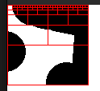
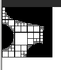
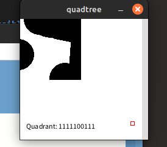
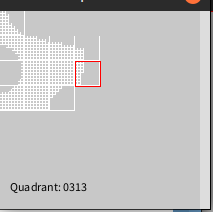
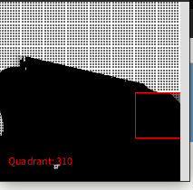
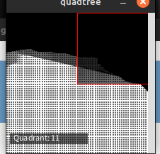

# Quad tree fun

# try 1

## good start but doenst split correctly only recusibly upwards

## much better but the stroke is all too crowding the image
and the mouse tool tip isnt working 
# got the tool tip working but broke the other stuff

# working draw function!

# but the number format is all messed up my guess is its some binary to intager conversion or just counting recusion calls not the actual binary number

better too tip + inverted the .bmp file's white and black

# prompt:
```python
create a processing.org python mode sketch.
create a binary tree (DONT USE LIBRARY)
create a bit map and read in bmp called "example.bmp"

def setup
canvas width 200
canvas hight 200
noStroke()

create a box test
set max_recusion depth = 5
set end condition = box test size = 2 or less

start with a box the size of the image
pus
iterate though each pixel until a 1 is found
if no 1's are found 
add current box to binary tree

if found split the box into 4 smaller quadrents
recursivly call box test until the test size is 2 wide


write tool tip that displays which quadrent the mouse is in by
displays the binary number which repersents the exact quadrent
and changes the color of the stroke for that quadrent  (DONT USE FSTRINGS)
    max recursion depth = 5
    return if mouse posiotion is found within the box and there are no more children leaf nodes
    get the mouse position
    recursily check which quadrent the mouse position is in inside the binary tree
return the binary number for quadrent that the mouse was found in
code only.
```